# Лабораторная работа №4 по дисциплине "Системы компьютерного зрения"

## Задача 
В рамках данной работы было необходимо обучить модель с любой архитектурой на наш выбор. Задача модели - находить, определять несколько классов объектов на изображении.

## Выбор архитектуры

### Выбор модели/архитектуры

&ensp; Первым пунктом будет выбор модели для выполнения задача. Формально, выбор состоит из двух направлений:

&ensp;  1) Использование готовой архитектуры

&ensp;  2) Создание своей архитектуры

&ensp; Рассмотрим сперва первый случай. Во многом он заключается в выборе каких-либо готовых моделей. В частности, будет необходим выбор архитектуры непосредственно для задачи детекции, среди самых популярных можно отметить:

&ensp; 1) YOLO (довольно популярная модель с большой скоростью работы и средней точностью)

&ensp; 2) Faster R-CNN (достаточно точная, но требует большое число ресурсов)

&ensp; 3) SSD (более быстрая архитектура, но при этом жертвует точностью)

&ensp; 4) RetinaNet (чаще всего применяется для многоклассовой классификации с большим числом классов, имеет хорошую точность, при этом скорость ниже, чем у YOLO)

&ensp; 5) EfficientDet (высокая точность, но требует большого числа ресурсов)

&ensp; На основе выше указанной информации была выбрана архитектура YOLO, так как она является одной из наиболе быстродейсвующих и, в текущий момент, одной из самых популяных является YOLO, поэтому предполагается, что будет применяться она.

### Описание архитектуры YOLO

&ensp; YOLO расшифровывается как You Only Look Once, является одной из популярнейших моделей для быстрой обработки изобржений. На текущий момент одной из самых новой версии будет являтсья 11, однако, в сообществе наиболее популярной осталась 8 версия, поэтому он будет применяться в дальнейшем и именно её мы попробуем рассмотреть достаточно подробно.

&ensp; Сперв поговорим об особенностях модели - скорость работы, которя достигается тем, что модель обрабатывает и проходит по изображению один раз, после чего выполняются все операции по клссификации, предсказанию рамки, оценки точностей предсказаний за один проход. Дання особенность позволяет быть модели досточно быстрой, чтобы выдавать результаты с достаточно высокой скоростью (до 180 обрабатываемых кадров в секунду (но данный факт упирется в железо)).

&ensp; Модель оптимизирована для работы в режиме реального времени, во многом это позволяют делать такие арзхитектурные модификации, как CSPDarknet, Anchor-Free Head. Поговорим о них более подробно.

&ensp; CSPDarknet - 

&ensp; В данной модели идёт 24 свёрточных слоя и 1 полносвязный в конце модели.

&ensp; Достаточно большой пласт знаний о данной модели был взят из данной [статьи]( https://habr.com/ru/articles/865834/) на HABR. 

## Обучение модели

### Выбор датасета

&ensp; Обычно датасет выбирается под конкретную задачу, то есть для задачи поиска котов выбирается датасет с котами и так далее. Наша задача представляет собой определение нескольких любых классов на изображении, то есть, в минимальнйо интопритации - 2 любых класса. В рамках текущей работы поставим задачей определени аниме лиц и автомобилей на изображении. Задача будет обнаружить их и выделить область на изображении с ними.

&ensp; Так как мы применяем архитектуру YOLO, она, как правило, предполагает наличие датасета с размеченными данными. Под разметкой подрузамеается наличие информции о положение объекта на изображении (выделение рамкой положение объекта на изображении).

&ensp;  Как итог, было обнаружено два датасета с  хорошими применами, достаточной разметкой и имеющим большое количество данных для обучения. Нет формулы вычисления числа примером изображения, необходимого для корректной работы детектора, так как это во многом зависит от задача. Чем сложнее задача - тем больше надо примеров для обучения модели. В рамках нашей задачи было примеренно 16000 изображений для класса автомобиль и около 6500 тысяч зображений для аниме лиц.

&ensp; Ссылки на датасеты: [машины](https://www.kaggle.com/datasets/seyeon040768/car-detection-dataset), [аниме лица](https://www.kaggle.com/datasets/andy8744/annotated-anime-faces-dataset?select=data.yaml).

&ensp; Стоит отметить, что детектор аниме лиц, предположительно, будет работать лучше, чем детектор автомобилей, даже при учёта большего числа примеров именно для второго класса. Во многом это связано с тем, что аниме лица сторого типизированные и обнаружить законоерности для них гораздо проще, чем для автомобиля. Сложность в автомобилях заключается в том, что автомобилей существует огромное количество и все они имеют разные формы и размеры, так же у них могут быть различные цвета, элементы, модификации. То есть два автомобиля отличаются друг от друга сильнее, чем два аниме лициа.

### Подготовка к обучени.

&ensp; В данном случаи архивы с датасетами будут подгружаться из GoogleDrive, после распаковываться и подгружается в модель. Оба датасета заранее разбиты на три выборки: тестовую (test), валидационная (valid), обучающая (train). Соотношение выборок 10% - 10% - 80% для обоих датасетов. Это стандартное распределение, чаще всего применяемое в обучение моделей.

&ensp; Мы берём датасеты, выгружаем и формируем смешанный датасет, состоящий из наборов изображений и их разметки из обоих датасетов. При этом каждое из изображений присваивается класс, отмеченный на нём (этот класс выбирается нами и его название выбирается нами, но нужно понимать, что если датасет состоит из размеченных изображений мячей, называть класс столом было бы конторпродуктивно).

&ensp; Процесс обучения на более чем 22500 изображений с двумя классами заняло около 1 часа на графических ускорителей сервиса Colab ().

### Процесс обучения

&ensp; Стоит отметить кривые обучения модели, они представлены ниже.

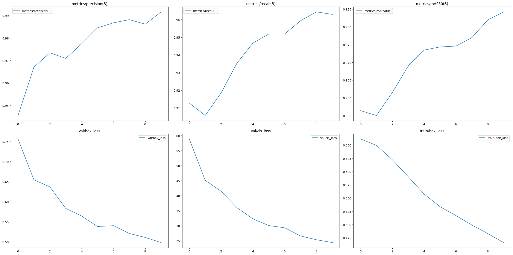

&ensp;  Данные график показывают процесс обучения для модели в целом, а не для каждого из классов по отдельности.

&ensp; Можно заметить, что ошибка на валидационных и тестовых данных уменьшается постепенно, что свидетельствует о нормальном процессе обучения без непосредственно переобучения на тренировочных данных (если бы ошибк валидационных данных увеличилась, в то время как тестовой - уменьшилась, значит модель, возможно, начала переобучаться. Разовый пик не говорит о начле переобучения, но если это стало трендом, то мы сможем говорить о однозначом зацикливнии модели на обучющей выборке).

&ensp; Точность модели постепенно увеличивается, как в плане детекции, так и в плане определения объекта с установкой рамок.

&ensp; Стоит отметить, что графики основных параметров, таких как точность и полнота, точность устнаовки рамки - увеличиваются, при этом стихийно, значит потенциально модель можно было бы дообучать. Однако, уже при текущих результатах, мы имеем высокую точность детекции машин и аниме лиц (если они не имеют сильных искажений относительно обучающего набора).

### Результаты обучения

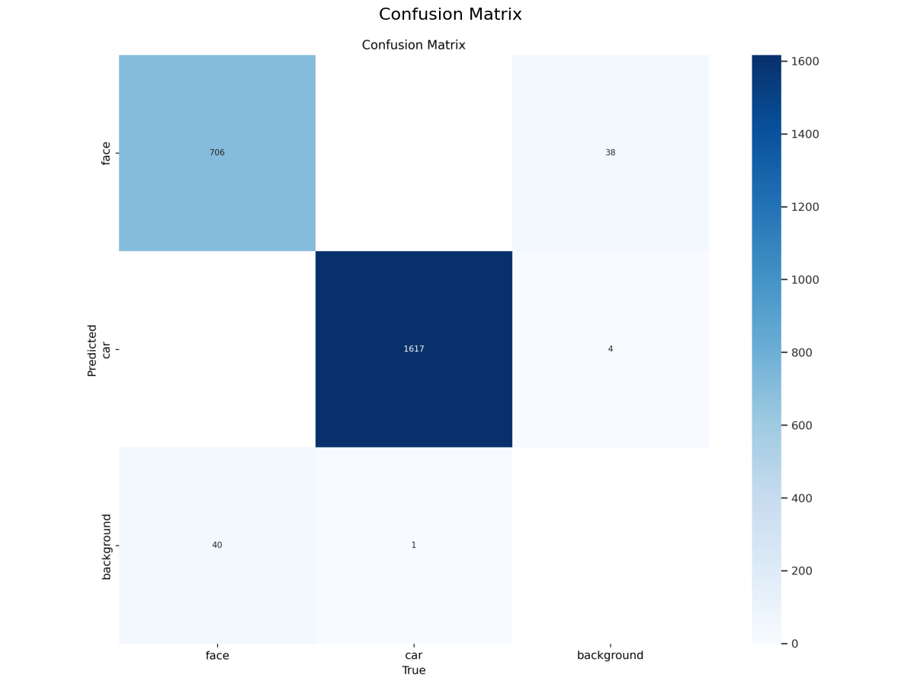

&ensp; Рассмотрим матрицу ошибоб для валидационной выборки. Рассмотрев матрицу, можно заметить, что модель обладает достаточно высокими показателями точности для обоих классов, что свидетельсвует об успешном обучении. Ложных срабатываний практически нет, что позволяет с уверенностью говорить о детекции объекта, если он или что-то очень похожее присутствует в кадре.

&ensp; Теперь рассмотрим основные метрики, полученные на финальной модели.

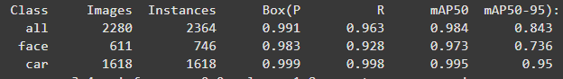

&ensp; 1) Точность определения (Precision) для класса машины - 0.999, для лиц - 0.983, для обоих классов - 0.991. Такое возможно благодаря наличию большому числу изображений в выборках, при этом большая часть изображения (или все) не имеют каких-то сложных сцен с частичным перекрытием или серьёзными искажениями объектов.

&ensp; 2) Полнота (Recall) для класса машины - 0.998, для лиц - 0.928, для обоих классов - 0.963. Не все лица в валидационной выборке были обнаружены, возможно, что там есть некоторое количество сложных примеров (которых нет в обучающей выборке) либо недостаточно обучающих данных с искажениями.

&ensp; 3) mAP50 (mean Average Precision) (точность установки box с перекрытием 50+% от рзмеченной части) для класса машины - 0.995, для лиц - 0.973, для обоих классов - 0.984. 

&ensp; 4) mAP50-95 (mean Average Precision)  (точность установки box с перекрытием 95+% от рзмеченной части)для класса машины - 0.995, для лиц - 0.736, для обоих классов - 0.843. 

&ensp; Теперь рассмотрим кривые обучения, которые представлены будут следующим образом.

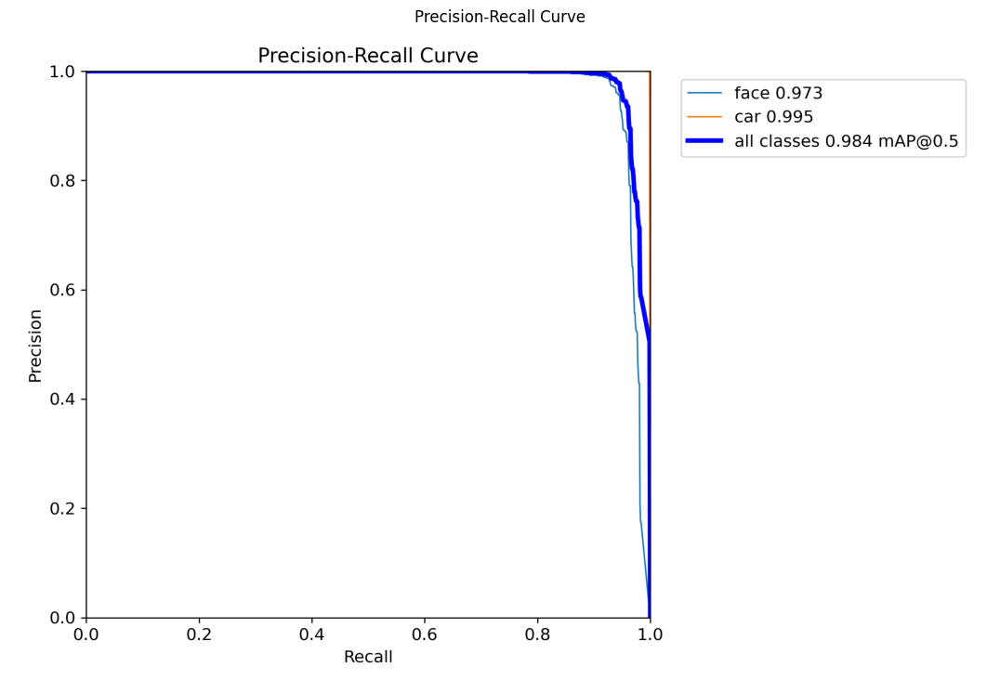

### Тесты на своих изображениях

&ensp;  Был выбран ряд случайных изображений для проверки работы получившейся модели. Стоит заметить, что обученная модель ни раз не видела данные изображения в процесс обучения и валидации, то есть, эти изображения ей не знакомы и являются хорошим примером для объективной оценки работы модели.

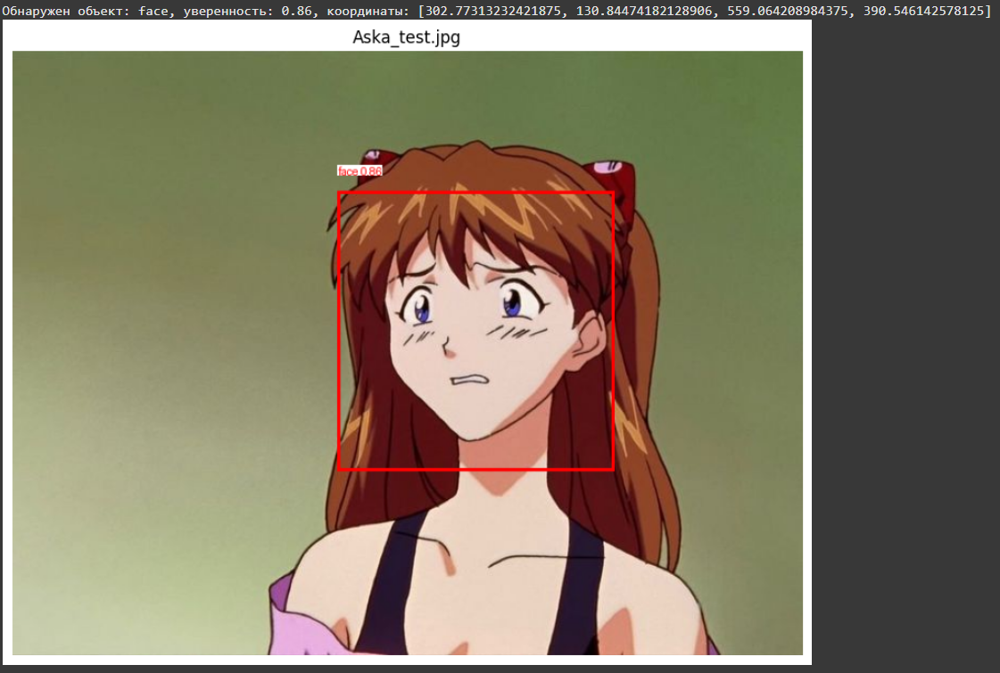

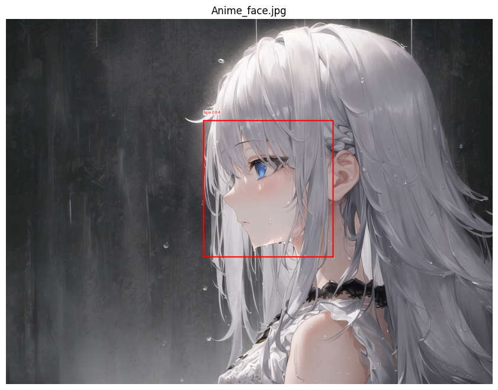

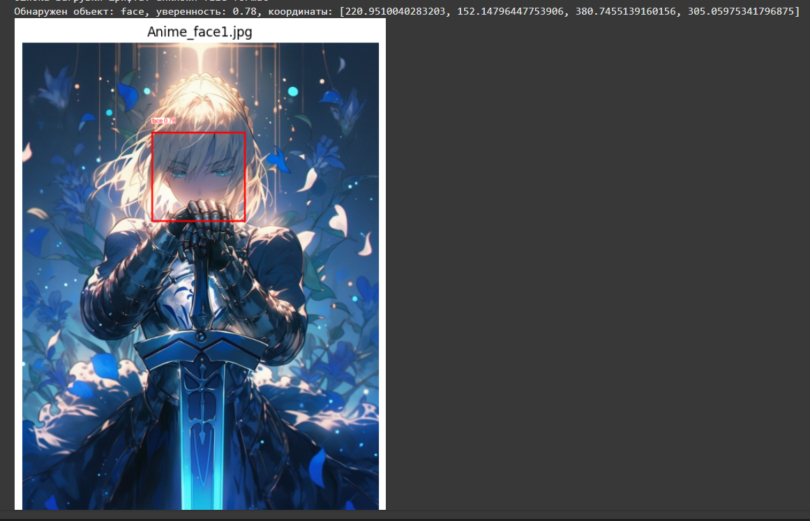

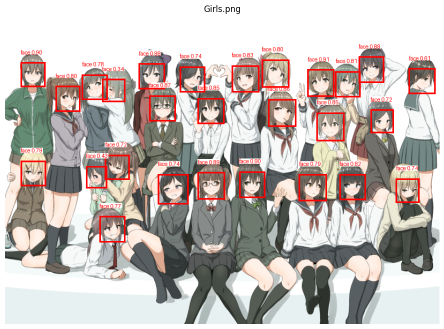

&ensp; На представленных выше примерах заметно, что обученная модель будет достатоно хорошо детектирует лица. При этом обнаруживаются лица как в фас, так и в профиль, так и с частичным (небольшим) перекрытием с достаточно высокой точностью - более 0.80 или 80%, что является достаточно хорошим результатом, достаточным для практического применения. Однако, модель во многом научена на цветных изображениях, более того, преимуществно женских, так же из-за стилистических различий рисовки, незнакомых для модели ракурсов - модель может не детектировать лицо, даже если его наличие очевидно для обычного человек. При этом модель неплохо справляется с детектирование лиц у группы персонажей, что подтверждает последний из представленных выше примеров.

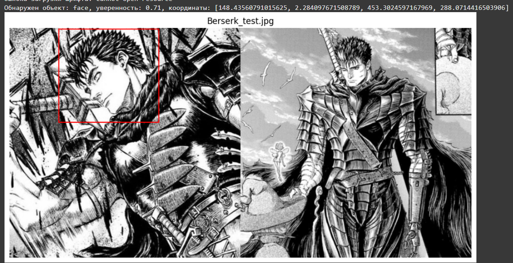

&ensp; Ранее работа проводилась на отрисованых аниме изображениях, однако, что если перейти на настоящие фотографии автомобилей с различными изображениями аниме лиц, в таком случаи проверим работу фильтра автомобилей и лиц в дейсвтии.

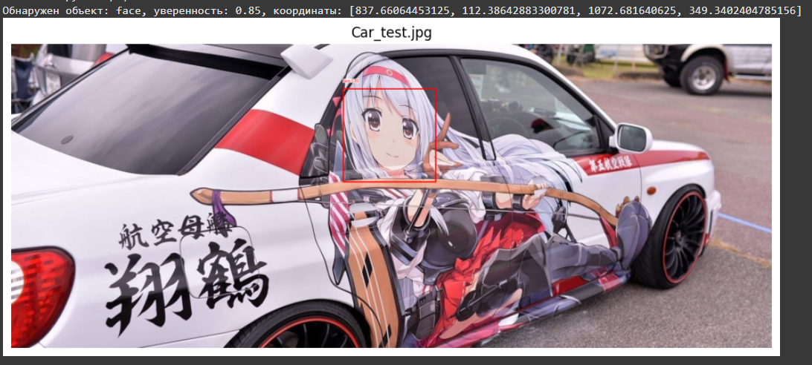

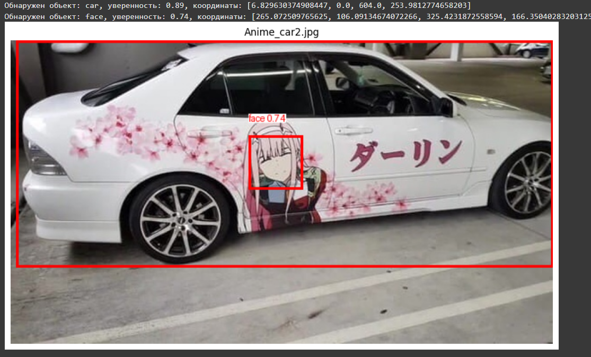

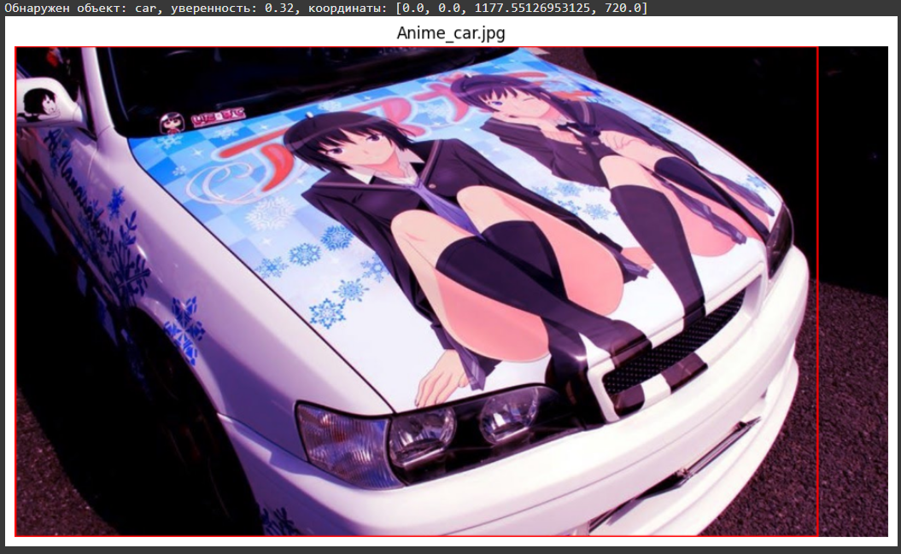

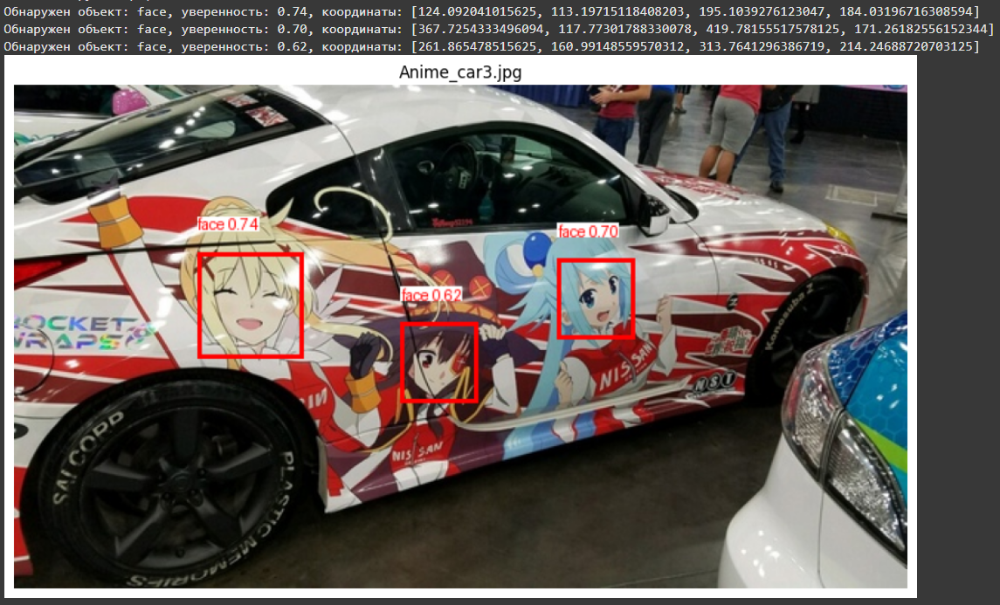

&ensp; На следующем наборе примеров заметно, что система не всегда хорошо детектирует автомобили. Во многом это из-за обрезанных изображений, что уменьшает число информации и сам факт наличия аниме наклеек и неоднородного цвета корпуса может вносить вклад в точность определения машины. При этом аниме лица под большим углом наклона так же не распознаются из-за перспективных искажений.

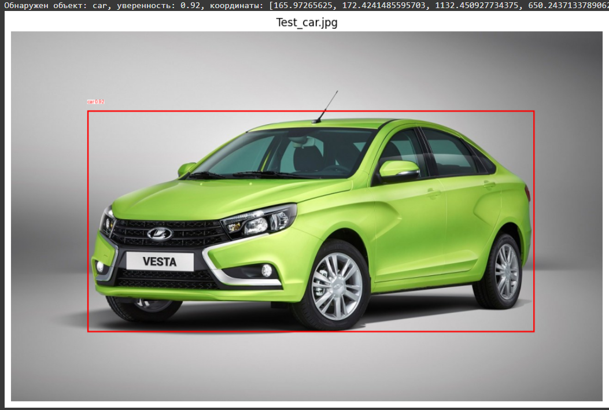

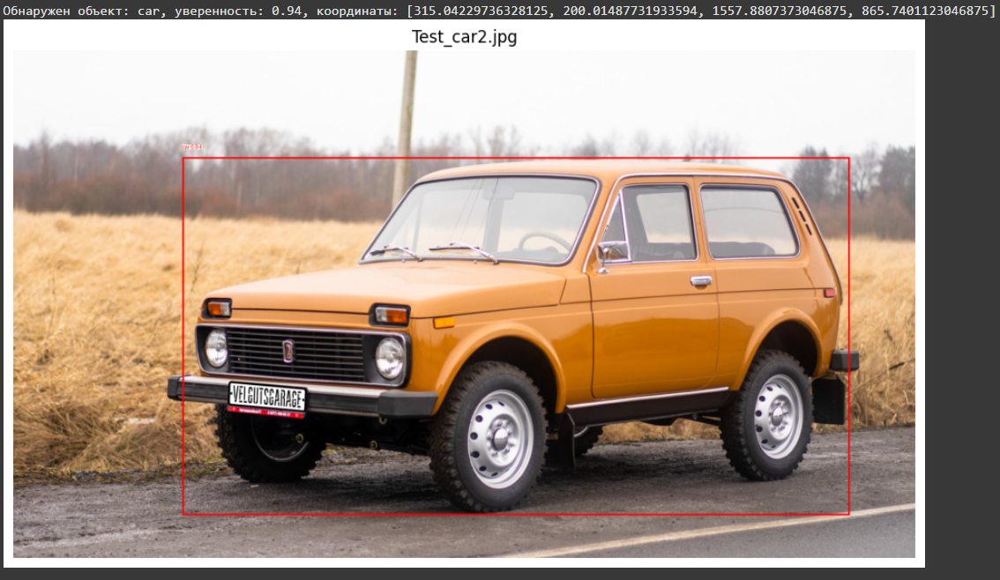

&ensp; Однако модель неплохо справляется, если автомобиль представлен полностью и без перекрытий, тогда получается результат определения точности свыше 0.9 или 90%.

### Оценка модели

&ensp; На основе всех полученных данных можно сказать, что модель научилась отлично детектировть автомобили с высокой точностью и аниме лица в простых сценах (несложные ракурсы, нет перекрытий, нет шумов) . Точность составляет 90+% для машин и около 70+% для аниме лиц.

&ensp; Для кооректного детектриованя автомобиля необходимо, чтобы он весь был в кадре.

## Итоги лабораторной работы

&ensp; В рамках данной лабораторной работы были выбраны датсеты и использованы для обучения модели на основе архитектуры YOLO, после была проведена оценка работы модели на случайных изображений с интернета, получены основные метрики модели и приведена их оценка, которая показал высокую точность модели на простых изображениях без каких-либо искжений и серьёзных изменений.

&ensp; Все ррезультаты работ представлены в данном репрезитории, а именно: обучення модель (настройки для неё), тестовые изображения, ссылки на датасеты, код в среде Colab для обучения своей модели или применении уже обученной в рамках данной работы.

