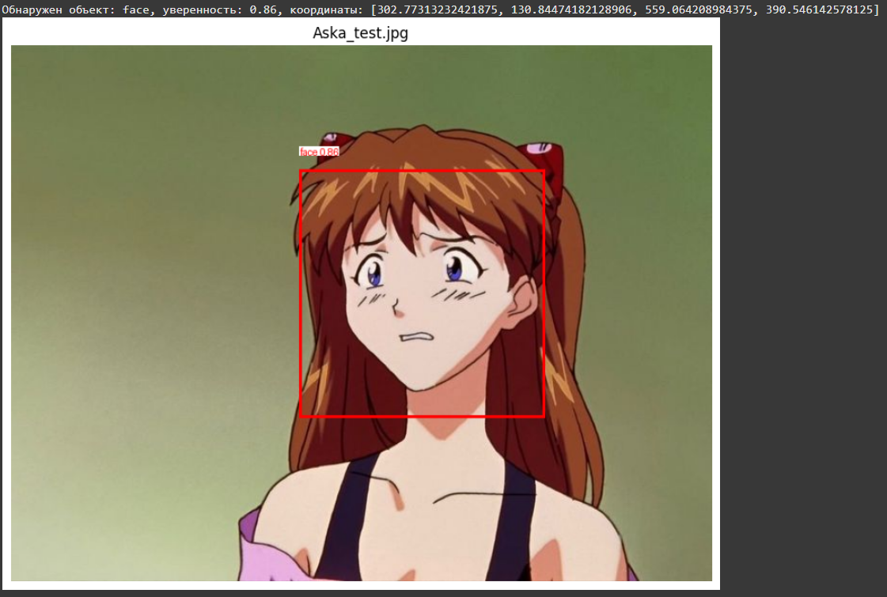
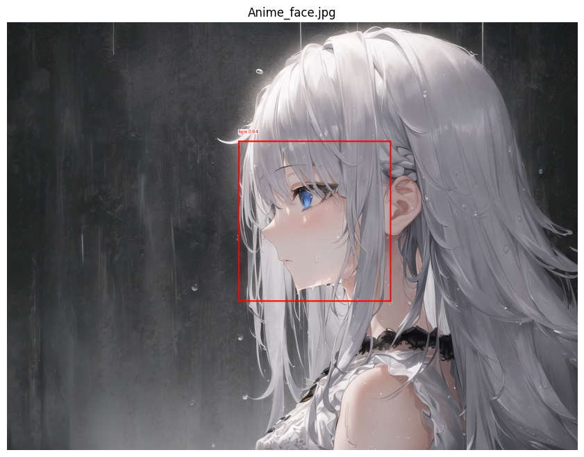
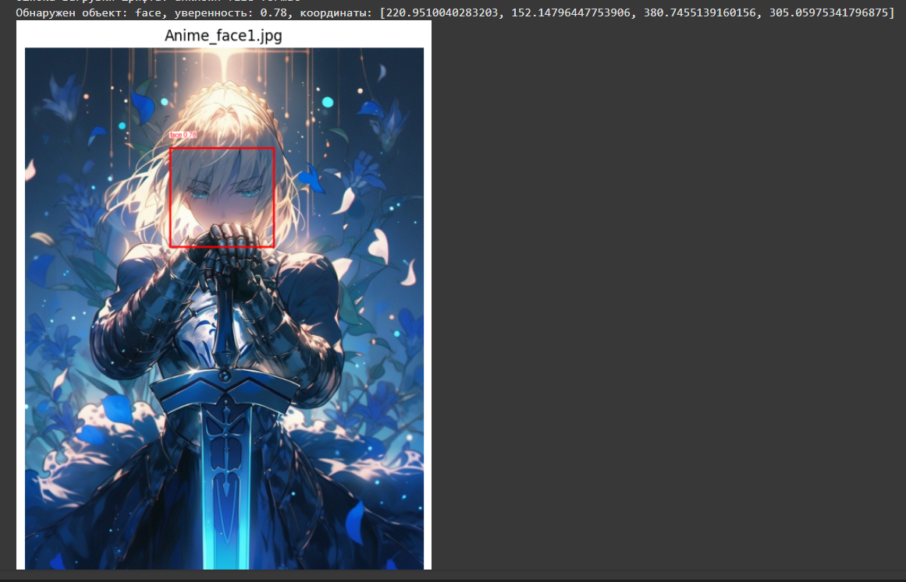
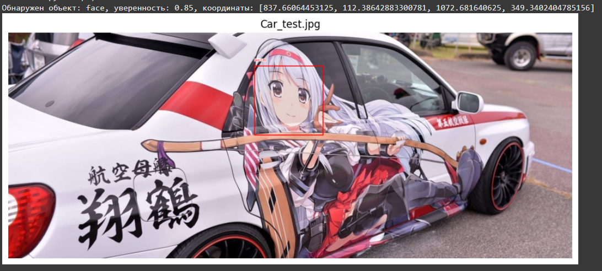
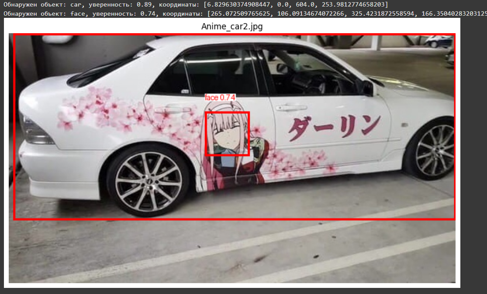
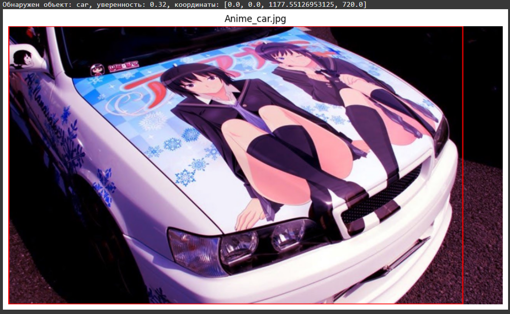
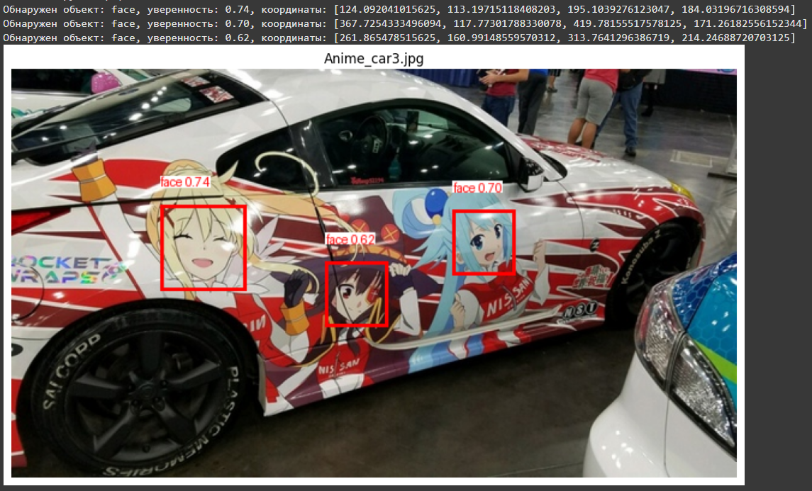

# Лабораторная работа №4 по дисциплине "Системы компьютерного зрения"

## Задача 
В рамках данной работы было необходимо обучить модель с любой архитектурой на наш выбор. Задача модели - находить, определять несколько классов объектов на изображении.

## Выбор архитектуры

### Выбор

&ensp; Первым пунктом будет выбор модели для выполнения задача. Формально, выбор состоит из двух направлений:

&ensp;  1) Использование готовой архитектуры

&ensp;  2) Создание своей архитектуры

&ensp; Рассмотрим сперва первый случай. Во многом он заключается в выборе каких-либо готовых моделей. В частности, будет необходим выбор архитектуры непосредственно для задачи детекции, среди самых популярных можно отметить:

&ensp; 1) YOLO (довольно популярная модель с большой скоростью работы и средней точностью)

&ensp; 2) Faster R-CNN (достаточно точная, но требует большое число ресурсов)

&ensp; 3) SSD (более быстрая архитектура, но при этом жертвует точностью)

&ensp; 4) RetinaNet (чаще всего применяется для многоклассовой классификации с большим числом классов, имеет хорошую точность, при этом скорость ниже, чем у YOLO)

&ensp; 5) EfficientDet (высокая точность, но требует большого числа ресурсов)

&ensp; На основе выше указанной информации была выбрана архитектура YOLO, так как она является одной из наиболе быстродейсвующих и, в текущий момент, одной из самых популяных является YOLO, поэтому предполагается, что будет применяться она.

### Описание архитектуры YOLO

## Обучение модели

### Выбор датасета

&ensp; Обычно датасет выбирается под конкретную задачу, то есть для задачи поиска котов выбирается датасет с котами и так далее. Наша задача представляет собой определение нескольких любых классов на изображении, то есть, в минимальнйо интопритации - 2 любых класса. В рамках текущей работы поставим задачей определени аниме лиц и автомобилей на изображении. Задача будет обнаружить их и выделить область на изображении с ними.

&ensp; Так как мы применяем архитектуру YOLO, она, как правило, предполагает наличие датасета с размеченными данными. Под разметкой подрузамеается наличие информции о положение объекта на изображении (выделение рамкой положение объекта на изображении).

&ensp;  Как итог, было обнаружено два датасета с  хорошими применами, достаточной разметкой и имеющим большое количество данных для обучения. Нет формулы вычисления числа примером изображения, необходимого для корректной работы детектора, так как это во многом зависит от задача. Чем сложнее задача - тем больше надо примеров для обучения модели. В рамках нашей задачи было примеренно 16000 изображений для класса автомобиль и около 6500 тысяч зображений для аниме лиц.

&ensp; Ссылки на датасеты: [машины](https://www.kaggle.com/datasets/seyeon040768/car-detection-dataset), [аниме лица](https://www.kaggle.com/datasets/andy8744/annotated-anime-faces-dataset?select=data.yaml).

&ensp; Стоит отметить, что детектор аниме лиц, предположительно, будет работать лучше, чем детектор автомобилей, даже при учёта большего числа примеров именно для второго класса. Во многом это связано с тем, что аниме лица сторого типизированные и обнаружить законоерности для них гораздо проще, чем для автомобиля. Сложность в автомобилях заключается в том, что автомобилей существует огромное количество и все они имеют разные формы и размеры, так же у них могут быть различные цвета, элементы, модификации. То есть два автомобиля отличаются друг от друга сильнее, чем два аниме лициа.

### Подготовка к обучени.

&ensp; В данном случаи архивы с датасетами будут подгружаться из GoogleDrive, после распаковываться и подгружается в модель. Оба датасета заранее разбиты на три выборки: тестовую (test), валидационная (valid), обучающая (train). Соотношение выборок 10% - 10% - 80% для обоих датасетов. Это стандартное распределение, чаще всего применяемое в обучение моделей.

&ensp; Мы берём датасеты, выгружаем и формируем смешанный датасет, состоящий из наборов изображений и их разметки из обоих датасетов. При этом каждое из изображений присваивается класс, отмеченный на нём (этот класс выбирается нами и его название выбирается нами, но нужно понимать, что если датасет состоит из размеченных изображений мячей, называть класс столом было бы конторпродуктивно).

&ensp; Процесс обучения на более чем 22500 изображений с двумя классами заняло около 1 часа на графических ускорителей сервиса Colab ().

### Процесс обучения

&ensp; Стоит отметить кривые обучения модели, они представлены ниже.

&ensp;  ТУТ БУДЕМ ИЗУЧАТЬ ЧТО И КАК, за что отвечает и что делает

### Результаты обучения

&ensp;  Был выбран ряд случайных изображений для проверки работы получившейся модели. Стоит заметить, что обученная модель ни раз не видела данные изображения в процесс обучения и валидации, то есть, эти изображения ей не знакомы и являются хорошим примером для объективной оценки работы алгоритма.

&ensp; На представленных выш примерах заметно, что обученная модель будет достатоно хорошо детектирует лица. При этом обнаруживаются лица как в фас, так и в профиль, так и с частичным (небольшим) перекрытием с достаточно высокой точностью - более 0.80 или 80%, что является достаточно хорошим результатом, достаточным для практического применения.

&ensp; Ранее работа проводилась на отрисованых аниме изображениях, однако, что если перейти на настоящие фотографии автомобилей с различными изображениями аниме лиц, в таком случаи проверим работу фильтра автомобилей и лиц в дейсвтии.

&ensp; На следующем наборе примеров заметно, что система не всегда хорошо детектирует автомобили. Во многом это из-за обрезанных изображений, что уменьшает число информации. При этом аниме лица под большим углом наклона так же не распознаются из-за перспективных искажений.

&ensp; Причины подобного рзультата были описаны ранее, когда высказывалось предположение о более точной работы классификатора аниме лиц, а не классификатора автомобилей.

&ensp; 

В КОЛАБ ЗАКИНУТЬ ПАРУ ТЕСТОВ, сделать модуь подрузки модели с гита, сделать подгрузку изображений для тестов с гита, и так далее

